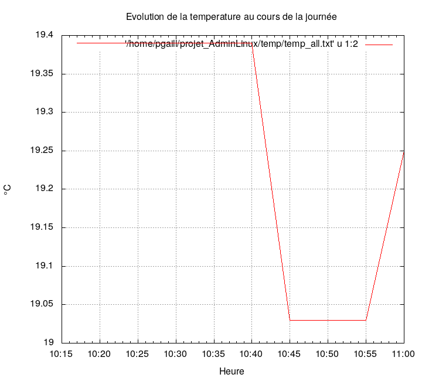
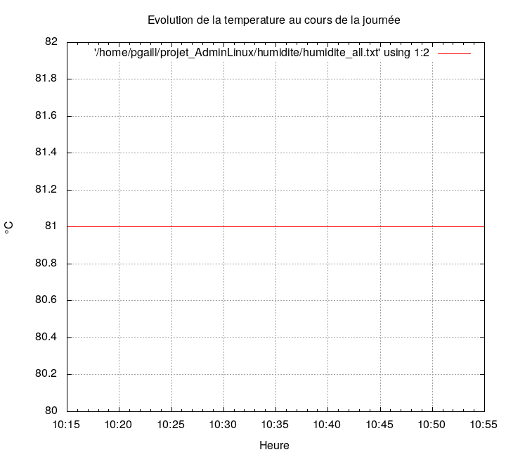
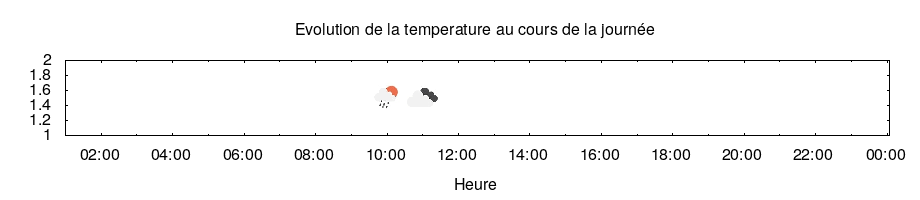

# Rapport météorologique de Nantes 

**Jour**: 16-05-2022 
**Emplacement**: Nantes (47.21'N,1.55'W)

##Temperature

| Heure | Température |
|----------|------------|
|  10      |  19.3      |
|  11      |  19.2      |
\- **Temperature min**: 19.25
\- **Temperature max**: 19.27

##Humidite

| Heure | Humidite |
|----------|------------|
|  10      |  74.7      |
|  11      |  75.0      |
\- **Humidite min**: 74.6667
\- **Humidite max**: 75

##Ciel

| Heure | Ciel |
|----------|------------|
|  11      | Clear      |
\- **Global**: Clear

