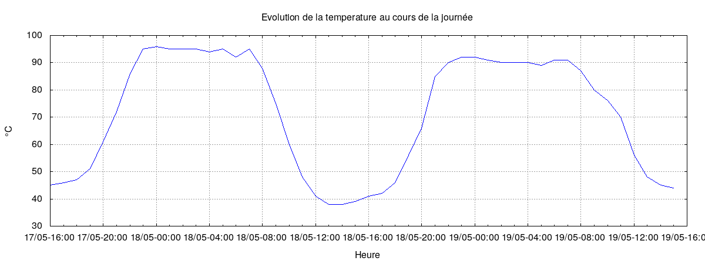

# Rapport météorologique de Nantes 

**Jour**: 22-05-2022 
**Emplacement**: Nantes (47.21'N,1.55'W)

##Temps sur 48 Heures

|               Heure               | Température |    Humidite |
|-----------------------------------|-------------|-------------|
|                                   |  273.1      |    0.0      |
|                                   |  273.1      |    0.0      |
|                                   |  273.1      |    0.0      |
|                                   |  273.1      |    0.0      |
|                                   |  273.1      |    0.0      |
|                                   |  273.1      |    0.0      |
|                                   |  273.1      |    0.0      |
|                                   |  273.1      |    0.0      |
|                                   |  273.1      |    0.0      |
|                                   |  273.1      |    0.0      |
|                                   |  273.1      |    0.0      |
|                                   |  273.1      |    0.0      |
|                                   |  273.1      |    0.0      |
|                                   |  273.1      |    0.0      |
|                                   |  273.1      |    0.0      |
|                                   |  273.1      |    0.0      |
|                                   |  273.1      |    0.0      |
|                                   |  273.1      |    0.0      |
|                                   |  273.1      |    0.0      |
|                                   |  273.1      |    0.0      |
|                                   |  273.1      |    0.0      |
|                                   |  273.1      |    0.0      |
|                                   |  273.1      |    0.0      |
|                                   |  273.1      |    0.0      |
|                                   |  273.1      |    0.0      |
|                                   |  273.1      |    0.0      |
|                                   |  273.1      |    0.0      |
|                                   |  273.1      |    0.0      |
|                                   |  273.1      |    0.0      |
|                                   |  273.1      |    0.0      |
|                                   |  273.1      |    0.0      |
|                                   |  273.1      |    0.0      |
|                                   |  273.1      |    0.0      |
|                                   |  273.1      |    0.0      |
|                                   |  273.1      |    0.0      |
|                                   |  273.1      |    0.0      |
|                                   |  273.1      |    0.0      |
|                                   |  273.1      |    0.0      |
|                                   |  273.1      |    0.0      |
|                                   |  273.1      |    0.0      |
|                                   |  273.1      |    0.0      |
|                                   |  273.1      |    0.0      |
|                                   |  273.1      |    0.0      |
|                                   |  273.1      |    0.0      |
|                                   |  273.1      |    0.0      |
|                                   |  273.1      |    0.0      |
|                                   |  273.1      |    0.0      |
|                                   |  273.1      |    0.0      |

\pagebreak 

##Temps sur 5 Jours

|               Date               | Température |    Humidite |
|-----------------------------------|-------------|-------------|
|                                   |  273.1      |    0.0      |
|                                   |  273.1      |    0.0      |
|                                   |  273.1      |    0.0      |
|                                   |  273.1      |    0.0      |
|                                   |  273.1      |    0.0      |
|                                   |  273.1      |    0.0      |
|                                   |  273.1      |    0.0      |
|                                   |  273.1      |    0.0      |
|                                   |  273.1      |    0.0      |
|                                   |  273.1      |    0.0      |
|                                   |  273.1      |    0.0      |
|                                   |  273.1      |    0.0      |
|                                   |  273.1      |    0.0      |
|                                   |  273.1      |    0.0      |
|                                   |  273.1      |    0.0      |
|                                   |  273.1      |    0.0      |
|                                   |  273.1      |    0.0      |
|                                   |  273.1      |    0.0      |
|                                   |  273.1      |    0.0      |
|                                   |  273.1      |    0.0      |
|                                   |  273.1      |    0.0      |
|                                   |  273.1      |    0.0      |
|                                   |  273.1      |    0.0      |
|                                   |  273.1      |    0.0      |
|                                   |  273.1      |    0.0      |
|                                   |  273.1      |    0.0      |
|                                   |  273.1      |    0.0      |
|                                   |  273.1      |    0.0      |
|                                   |  273.1      |    0.0      |
|                                   |  273.1      |    0.0      |
|                                   |  273.1      |    0.0      |
|                                   |  273.1      |    0.0      |
|                                   |  273.1      |    0.0      |
|                                   |  273.1      |    0.0      |
|                                   |  273.1      |    0.0      |
|                                   |  273.1      |    0.0      |
|                                   |  273.1      |    0.0      |
|                                   |  273.1      |    0.0      |
|                                   |  273.1      |    0.0      |
|                                   |  273.1      |    0.0      |

\pagebreak 

##Temps sur 7 Jours

|               Date               | Température |    Humidite |
|-----------------------------------|-------------|-------------|
|                                   |  273.1      |    0.0      |
